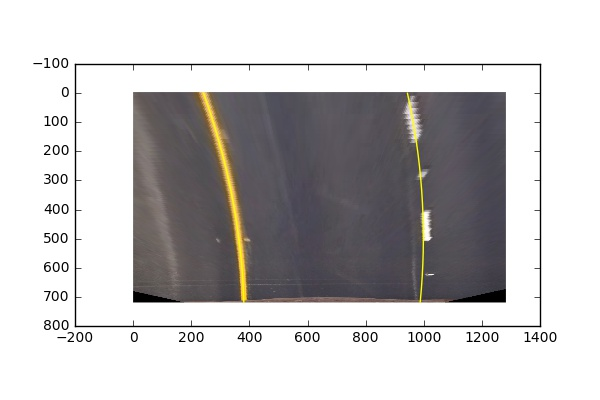
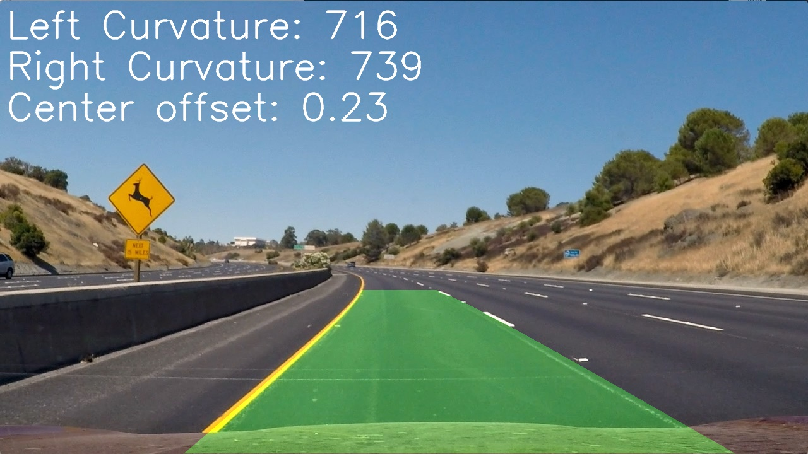

Note: All code can be found in [Video Pipeline.ipynb](Video Pipeline.ipynb)

## Camera Calibration

I first calculate the object and image points. To do so, I step through each of the provided chessboard images and use the cv2.findChessboardCorners function to detect the corners. When I successfully detect all the corners, I append the object points - which are the pre-calcuated object points assuming that z=0 and equally spaced chessboard corners of size 9x6 - and the detected corners to a list. Those lists are passed to cv2.calibrateCamera to get the calibartion information which is then passed to cv2.undistort to undistort an image. Here is an example of a distorted image:

And the undistored version:

## Pipeline

### Question 1

Here is an example of a distortion corrected image:

### Question 2

I used both gradient and color thresholds to binarize the image. See method binary_pipeline. First, I convert the image to the HLS color space and extract the L and S color channels. On the L channel, I take the Sobel with respect to x with a kernel size of 3. I then threshold this gradient with a minimum cutoff value of 20 and a maximum of 100. I then threshold the S channel with a minimum of 170 and a maximum of 255. Both of these thresholds are then combined and applied to the image.

Here is an example:

### Question 3

For the code, see function warper. To perform the warp, I use the src and dest points provided in the example write up. These are hard coded into my function. I pass these to cv2.getPerspectiveTransform to get the M and Minv matricies. The M matrix is then passed to cv2.warpPerspective with the image to warp the perspective. 

Here is the warped version of the image provided in Question 1.

### Question 4

To identify lane pixels and fit their positions, I first perform a histogram of a binary warped image. I then take the midpoint and the locations of the peaks on the left and right of the historgram. If I have previous images in my object, I use their midpoints to limit my search space in the histogram. I then perform the windowing technique to follow the pixels up the image and keep track of the left and right, x and y pixel locations that are white in the binary image. Once I have all those pixels, I use np.polyfit to fit a second order polynomial to the data. That polynomial is then plotted onto the image. An example of this can be seen here (see the yellow lines):

### Question 5

In the get_curvature function I calculate the left and right curvatures. In lines 186-192 of the FindLanes class, I calculate the offset from center. All values are in meters. The curvature values are calculated by re-fitting the lines using np.polyfit, but with adjustments to the pixel values to convert them into meters. I then just use the equation provided to calculate the radius of curvature for each line evaluated at the 1/2 way point of the image. For the offset from center, I take the midpoint between each of the polynomial fit lines at the bottom of the image and from that subtract the midpoint of the image. This value is then multiplied by a constant to convert from pixels to meters.

### Question 6

Here is an example image that shows the result of this entire process with the lines projected back down onto the image.

## Pipeline Video

[Pipeline Video](./project_video_lines.mp4)

Note: I update the curvate and off center values every 10th frame to make them more readable.

## Discussion

I was surprised by how well a pretty standard implementation of all the techniques worked without any additional work. My first attempt wasn't perfect, but I was surprised that for 75% of the video it worked well. The major challenges appeared when trying to drive over the lighter parts of the road. My lines would become much more curved and much wider than the actual lane. To fix the later, I implemented the window search to start close to where the last lines were found; this helped to avoid finding outlier lines on the edges of the frames. I also added a distance check to make sure the two lines were far enough apart to actually make sesnse and when they were not to go back to searching across the entire image. To fix the sometimes wiggly lines, I added a smoothing function using a python deque that stores the pixels found for the last 10 lines. These are then averaged to generate the polynomial for the current image. 

My pipeline is likely to fail in areas in which the lane lines are not in high contrast to the road. Things like light patches on the road, shadows, or enivornmental factors like snow would make it hard to identify the lines. And if you can't indentify the lines everything else falls apart. That being said, additional smoothing or adding a strong prior when confident lines couldn't be found would probably be sufficient to produce good results for a short period. The real issue would be long stretches of "non-normal" road conditions.
