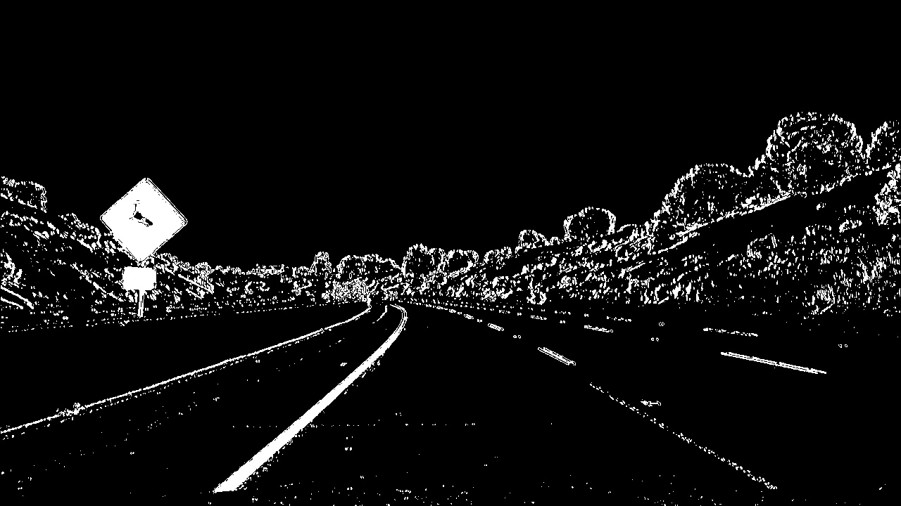
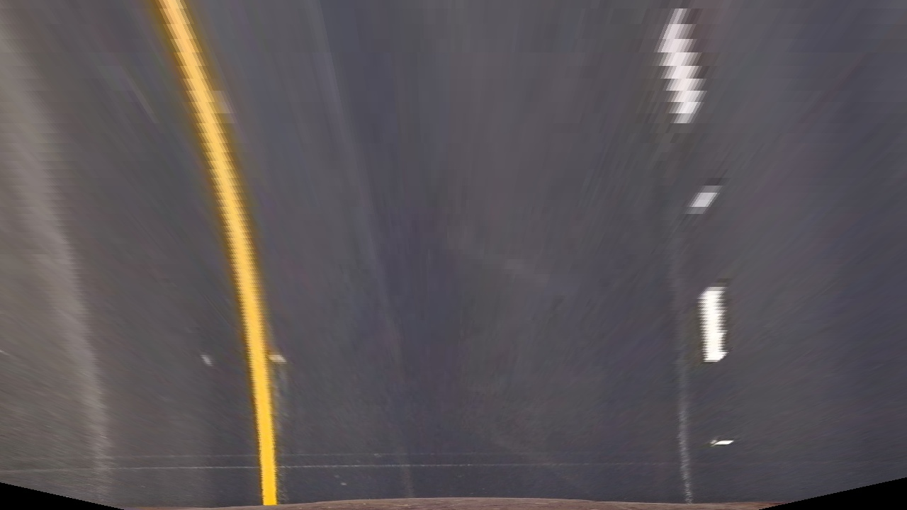

Note: All code can be found in "Video Pipeline.ipynb"

## Camera Calibration

I first calculate the object and image points. To do so, I step through each of the provided chessboard images and use the cv2.findChessboardCorners function to detect the corners. When I successfully detect all the corners, I append the object points - which are the pre-calcuated object points assuming that z=0 and equally spaced chessboard corners of size 9x6 - and the detected corners to a list. Those lists are passed to cv2.calibrateCamera to get the calibartion information which is then passed to cv2.undistort to undistort an image. Here is an example of a distorted image:

And the undistored version:

## Pipeline

### Question 1

Here is an example of a distortion corrected image:

### Question 2

I used both gradient and color thresholds to binarize the image. See method binary_pipeline. First I convert the image to HLS color space and extract the L and S color channels. On the L channel I take the Sobel with respect to x with a kernel size of 3. I then threshold this gradient with a minimum cutoff value of 20 and a maximum of 100. I then threshold the S channel with a minimum of 170 and a maximum of 255. Both of these thresholds are then combined and applied to the image.

Here is an example:

### Question 3

For the code, see function warper. To perform the warp, I use the src and dest point provided in the example write up. These are hard coded into my function. I pass these to cv2.getPerspectiveTransform to the the M and Minv matricies. The M matrix is then passed to cv2.warpPerspective with the image to warp the perspective. 

Here is the warped version of the image provided in Question 1.

### Question 4

