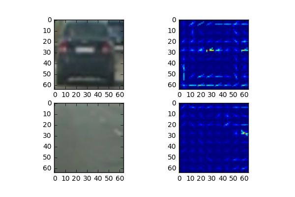
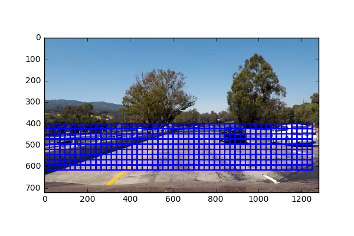
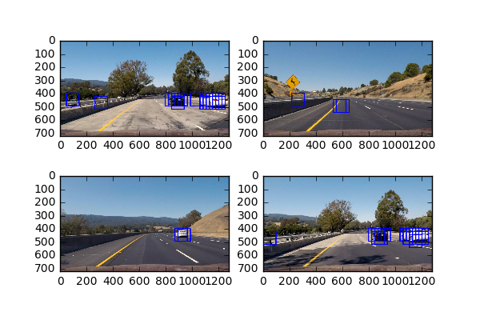
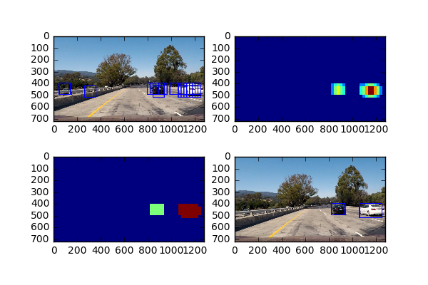

Note: All code found in Pipeline.ipynb

## HOG

1. The code for this step is included in the get_hog_features method. I used the skimage.hog() function with YCrCb color space and HOG parameters of orientations=8, pixels_per_cell=(8, 8) and cells_per_block=(2, 2). Here is an example for a car and a not-car image. The original images are on the left and the hog features from the first channel on the right.

2. I originally did a standard grid search from 2-4 on the cells_per_block and 6-8 on the pixels_per_cell. When training the SVM, though, I achieved the highest testing accuracy of 99.21% when using the parameters I selected above.

3. I trained a linear SVM using the HOG parameters mentioned above as well as spatial and histogram features. For the color histograms, I used 32 bins and for the spatial features I down-sized the images to (32,32). I also scaled the features using sklearn's X_scaler and randomly split the data into training and testing with 20% for testing. I achieved a testing accuracy of 99.21%.

## Sliding Window Search

1. My sliding window search happens in the find_cars() method. I ended up using a yStart of 400 and a yStop of 656 with a scale of 1.5. I used a cells_per_step of 3. I landed on these values through experimentation. A scale of 1 seemed to small and a scale of 2 too large. My yStart and yStop caught everything I could see and a low value for cells_per_step seemed optimal, though, increased the time to run due to more boxes than a larger number. Here is what it looks like:

2. Here are some examples. The main thing I did to increase the performance was the calculate the hog features for the entire image once and then select the sections I needed for the boxes I was analyzing. 

## Video Implementation

1. Here is a [link](project_video_detection.mp4) to my video.

2. I kept track of all the predicted boxes I found (see method find_cars()). With these boxes I then created a heat map (see method add_heat()) by adding ones to pixels in predicted boxes and zeros everywhere else. I assumed each "blob" in the heatmap was a car and used scipy.ndimage.measurements.label() to extract the bounding boxes to cover that blob. Here is an example of the process on an image:

## Discussion

1. Honestly, the biggest problem I ran into was making sure I was scaling the images correctly. At first, my video would only return dark images because it turns out that the video function needs the images in the 0-255 range. Also, debugging the pipeline was a bit difficult as there were many steps involved, so it was sometimes hard to track down exactly where things were failing. I also spent a lot of time tweaking parameters to see what worked best. This wasn't necessarily a problem; just time consuming. I think maybe using a deep learning approach might minimize some of the need for parameter tuning. My pipeline will likely fail with tiny cars off in the distance as well as with other motorized objects like motorcycles. I think the main thing I could do to make my pipeline more robust is to search over more scales and over a larger fraction of the image. This just takes more time.
