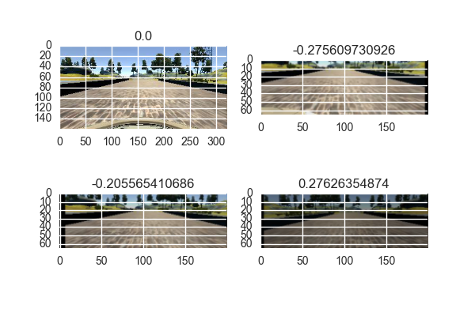
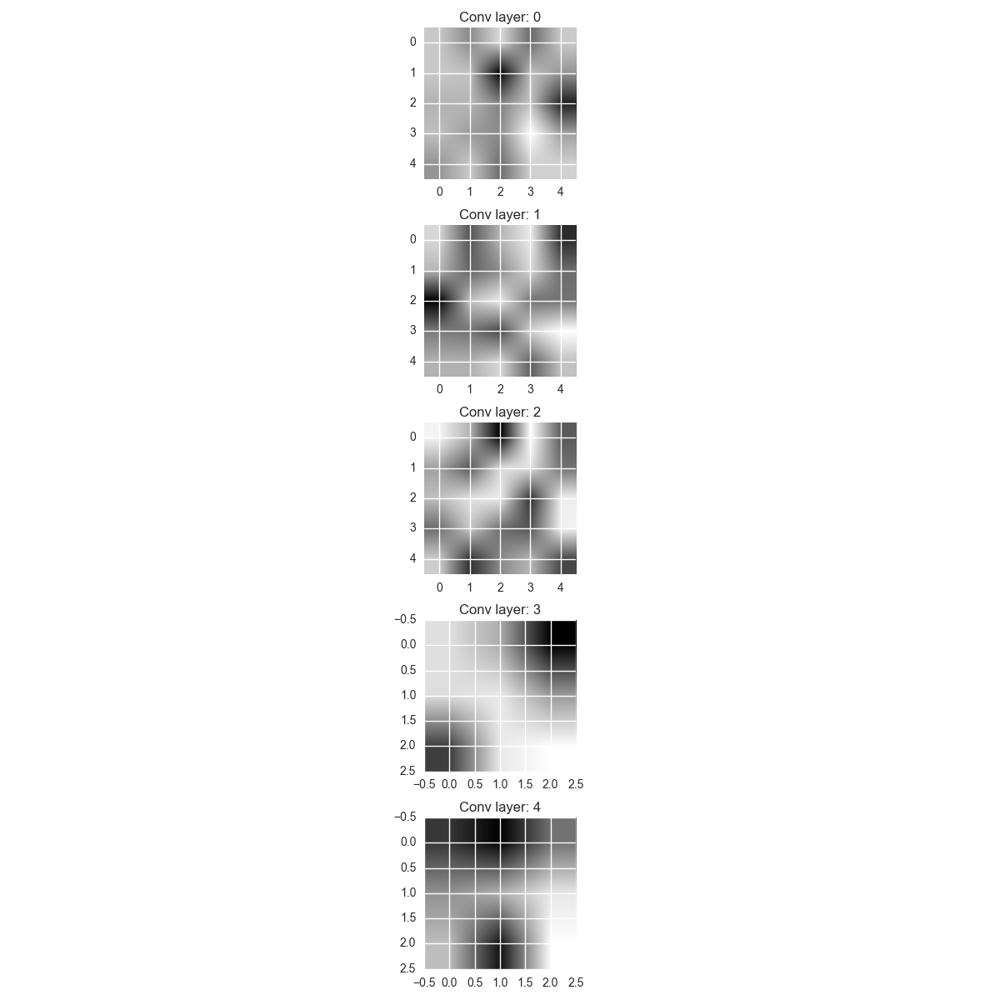
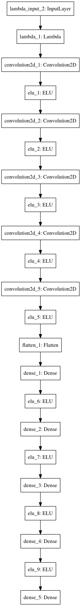

## Description of Process

I started this project off with a simple strategy, use the [comma ai model](https://github.com/commaai/research/blob/master/train_steering_model.py) on the center images. To test that my pipeline was working, I made sure that I could overfit to three images - one straight, one left, and one right. I discovered that subtracting a mean image and dividing by a mean standard deviation worked much better than dividing the pixels by 255 in this case.

I then trained the model for 5-10 epochs on the center images, but when tested on the track, failed pretty miserably. I could only go for 5 to 10 seconds before driving left off the track. This is when I discovered that using a validation set wasn't too helpful as the validation MSE could by good, but the driving results poor. On my next iteration, I used all the data for training and evaluated various epochs on the simulator.

My next strategy was to add the left and right camera angles and adjust the angle by 0.15. This helped a little, but still failed to get the car to drive more than about 20 seconds on the track. I also discovered that a 0.25 adjustment seemed to work better that 0.15, 0.20, or 0.30. 

At this point, I started to read more on the confluence and slack channel about some strategies others have tried. That is how I came upon this [post](https://chatbotslife.com/learning-human-driving-behavior-using-nvidias-neural-network-model-and-image-augmentation-80399360efee#.lsuveu9f6) as well as the [NVIDIA paper](https://devblogs.nvidia.com/parallelforall/deep-learning-self-driving-cars/). From reading these two sources, I decided to (1) try the NVIDIA (see more description below) model instead of the comma ai model and (2) perform significantly more data augmentation. From the blog post, I utilized his method of augmenting the brightness of the images. I also used the image translation and rotation augmentation mentioned in the NVIDIA paper. For rotation, I only flipped the images and flipped the steering angle. For translation, I used a mean zero, standard deviation 10 normal distribution and adjusted the steering angle by .004 for each change in x pixel. I tried multiple values here, but found these to work the best and .004 was also recommended by the blog post. All these steps were similar, but slightly modified from the blog post as well. From the blog post, I also used the image cropping as from my tests, it seemed to be effective at isolating the road section of the image. Lastly, I randomly chose a left, right, or center image. Adjusting the left and right images by 0.25 and -0.25 respectively. 

On the training side, I upsampled images with high steering angles to prevent the car from being biased towards only driving straight. This is mentioned in both the NVIDIA paper as well as the blog post. I also add validation data as it is being sampled from a much larger, augmented set of data. And this helped me better judge when I might have reached a good number of epochs.

I also tried adding dropout layers to the NVIDIA model, but always got worse performance on the test track, so I removed them. I believe that the extensive data augmention helped prevent overfitting and adding dropout was over kill. I also iterated extensively on some of the hyperparameters mentioned above for adjusting steering angles and translating images. It is amazing how much slight changes in those numbers can lead to fairly large changes in test performance.

Using the validation set as my guide, I settled on 8 epochs with a batch size of 256 and 25600 samples per epoch. This results in a model that can drive the first track, but struggles a bit on the second track. I plan on spending some more time on getting a less jerky result on the first track and generalizing to the second track.

## Visualizations of data

See the images below to get a sense of my data augmentation. The top left image is the original and the others are randomly generated augmented images. The steering angles are posted above each image.

## Visualizations of convolutional layers

To get a sense of what the network might be learning, I ouptut the maximum value for each convolutional layer for the 12th filter in each layer. It is very interesting to see how the early layers activations are much harder to understand while the later layers take on more meaningful shapes such as a diagonal lione and an upside down u shape.

## NVIDIA Model Architecture

The NVIDIA model starts with a normalization layer that converts the pixel data into the 0-1 range. It then has 5 convolutional layers; each followed by ELU activation. ELUs were used because it is less likely to saturate (like RELU), but ELUs can have negative values which brings its mean activation value closer to zero which speeds up learning. The first three convolutional layers have a stride of 2 and the last 2 a stride of 1. All are valid padding with guassian initialization. The depths of the convolutional layers are 24, 36, 48, 64, and 64 respectively. 

Then 5 fully connected layers follow; all initialized with guassian initialization. Each is followed by ELU activation (except the last). The sizes are 1164, 100, 50, 10, and 1.

